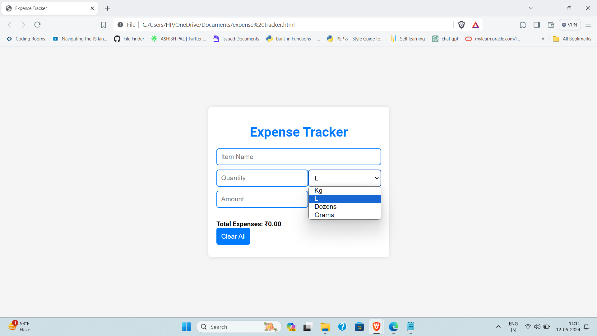

# Expense Tracker
Expense Tracker is a simple web application that helps users keep track of their expenses. Users can add items with their names, quantities, units, and amounts, and the application calculates the total expenses.

## Features
- Add items with their names, quantities, units, and amounts.
- Choose from a variety of quantity units such as Kg, L, dozens, and grams.
- View a list of added items with their total cost.
- Highlight items with higher amounts for easy identification.
- Clear all items to start over.

## Technologies Used
- HTML
- CSS
- JavaScript

## Getting Started
To use the Expense Tracker, follow these steps:
1. Clone the repository:
   git clone https://github.com/surajsri23/expenses-tracker.git
2. Navigate to the project directory:
3. Open the `index.html` file in your web browser.

## Usage
1. Enter the name of the item in the "Item Name" input field.
2. Enter the quantity and select the appropriate unit from the dropdown menu.
3. Enter the amount in the "Amount" input field.
4. Click the "Add Item" button to add the item to the list.
5. View the list of added items along with their total cost.
6. Optionally, click the "Clear All" button to remove all items and start over.

## Preview

## Contributing
Contributions are welcome! If you'd like to contribute to this project, please follow these steps:
1. Fork the repository.
2. Create a new branch (`git checkout -b feature/yourfeature`).
3. Make your changes.
4. Commit your changes (`git commit -am 'Add new feature'`).
5. Push to the branch (`git push origin feature/yourfeature`).
6. Create a new Pull Request.

## License

This project is licensed under the MIT License. See the [LICENSE](LICENSE) file for details.

